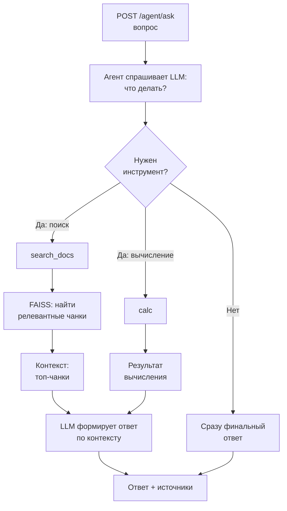

# RAG + Agent + MCP (pet-проект)

## TL;DR Quickstart
**Local:** venv → dependencies → build index → run api → demo  
**Docker:** compose up → smoke test

## 1) Что это за проект
Этот репозиторий — компактный, но воспроизводимый MVP: RAG‑сервис с индексом FAISS, агентом с tool‑calling и MCP‑сервером/клиентом. Он показывает полный контур от ingestion документов до ответов через FastAPI, а также переключение инструментов между локальной реализацией и через MCP сервер. Проект ориентирован на демонстрацию инженерной зрелости: чистые скрипты, воспроизводимые шаги, Docker‑сборка и прозрачные ограничения.

RAG‑часть отвечает за подготовку индекса (чанкинг, эмбеддинги, FAISS) и за `/ask`‑эндпоинт, который комбинирует retrieval и LLM‑ответ. Агентная часть строит ответ на базе tool‑calling: сначала выбирается инструмент (`search_docs` или `calc`), затем LLM формирует финальный ответ из наблюдений. MCP слой позволяет вынести инструменты в отдельный HTTP‑сервер и демонстрирует клиент/серверную интеграцию с контролем лимитов и ошибок.

Сервис рассчитан на локальный LLM через Ollama (по умолчанию), но архитектура оставляет возможность OpenAI‑совместимого режима.

## 2) Фичи
- Ingestion документов `.txt/.md/.pdf` с нормализацией текста и чанкингом.
- Векторный индекс FAISS с сохранением метаданных и контрольной проверкой модели эмбеддингов.
- FastAPI API с `/ask` (RAG) и `/agent/ask` (agent tool‑calling).
- Инструменты `search_docs` и `calc` (локально или через MCP сервер).
- Переключение backend‑а инструментов: `TOOL_BACKEND=local|mcp`.
- Docker / docker‑compose для воспроизводимого запуска.
- Smoke‑тесты для проверки API, MCP и agent‑потока.

## 3) Архитектура


## 4) Repository map (кратко)
- `src/app/` — FastAPI приложение и эндпоинты `/ask` и `/agent/ask`.
- `src/rag/` — логика retrieval и LLM‑клиенты.
- `src/agent/` — агент и инструменты (`search_docs`, `calc`) + переключение backend‑ов.
- `src/mcp/` — MCP server/client для инструментов.
- `src/ingest/` и `src/index/` — ingestion и FAISS‑индекс.
- `scripts/` — сборка индекса, демо, smoke‑тесты, примеры вызовов API.
- `data/` — документы и индекс (создаётся при сборке).
- `docker-compose.yml` и `Dockerfile` — контейнеризация API/MCP.
- `docs/repo_map.md` — подробная карта репозитория.
Полная карта со смыслом каждого файла: `docs/repo_map.md`.

## 5) Prerequisites
- Python 3.11+
- Ollama установлен и модель скачана
- Docker (опционально)

Проверка Ollama через Python:
```bash
python - <<'PY'
import json
from urllib.request import urlopen

with urlopen("http://localhost:11434/api/tags") as r:
    print(json.loads(r.read().decode("utf-8")))
PY
```

## 6) Установка и запуск (локально)

### 1) Виртуальное окружение и зависимости
Windows (PowerShell):
```bash
python -m venv .venv
.\.venv\Scripts\Activate.ps1
pip install -r requirements.txt
```

Linux/macOS:
```bash
python -m venv .venv
source .venv/bin/activate
pip install -r requirements.txt
```

### 2) Запуск Ollama и проверка доступности
По умолчанию используется `OLLAMA_BASE_URL=http://localhost:11434` и модель `llama3.2:3b`.

```bash
ollama serve
```

### 3) Построение индекса
```bash
python -m scripts.build_index
```
Индекс создастся в `data/index`.

### 4) Запуск API
```bash
uvicorn src.app.main:app --host 0.0.0.0 --port 8000
```

### 5) Запуск MCP server
В отдельном терминале:
```bash
python -m scripts.run_mcp_server
```

### 6) Примеры запросов (python‑скрипты)
```bash
# RAG endpoint
python -m scripts.call_api "Как восстановить доступ к аккаунту?" --url http://localhost:8000/ask --debug

# Agent endpoint
python -m scripts.call_api "Посчитай 3.5% от 12000" --url http://localhost:8000/agent/ask
```

## 7) Запуск через Docker

### 1) Старт сервисов
```bash
docker compose up --build
```

### 2) Переменные окружения
- `OLLAMA_BASE_URL` — базовый URL Ollama (в compose по умолчанию `http://host.docker.internal:11434`).
- `TOOL_BACKEND` — `local` или `mcp` (переключает инструменты агента).
- `MCP_URL` — URL MCP‑сервера для клиента (в compose по умолчанию `http://mcp:9001`).

Пример переключения MCP backend:
```bash
TOOL_BACKEND=mcp docker compose up --build
```

### 3) Smoke‑test
```bash
python -m scripts.docker_smoke_test
```
Таймаут в 180 секунд заложен на прогрев модели Ollama при первом запуске.

## 8) Demo
```bash
python -m scripts.demo_agent
python -m scripts.demo_mcp_tools
python -m scripts.demo_agent_mcp
```

## 9) LangChain demo (optional)
Этот режим — демонстрация альтернативного RAG‑подхода через LangChain. LangChain‑демо входит в main‑ветку и
доступен после установки `requirements.txt`, но является опциональным для основного `/ask` потока.

### Как запустить
```bash
# FastAPI endpoint
python -m scripts.call_api "Как восстановить доступ к аккаунту?" --url http://localhost:8000/ask_langchain

# CLI demo
python -m scripts.demo_langchain "Как восстановить доступ к аккаунту?"
```

### Что демонстрирует
- Обёртку существующего `Retriever.search(...)` в LangChain Runnable‑цепочку.
- Генерацию ответа через существующий LLM клиент (Ollama/OpenAI‑compatible), без доп. векторных БД.

### Чем отличается от основного
- Основной RAG (`/ask`) работает без LangChain.
- LangChain‑демо — отдельный optional‑слой для сравнения альтернативного подхода.

## API endpoints
- `POST /ask` — RAG.
- `POST /agent/ask` — agent tool‑calling.
- `GET /health` — health check.
- `GET /debug/search`, `GET /debug/index`, `POST /ask_langchain` — debug и demo эндпоинты.

## Что доказывает по стеку
- Docker/compose: сервисы API + MCP запускаются одной командой.
- FastAPI: REST‑эндпоинты `/ask`, `/agent/ask`, `/debug/*`.
- RAG + FAISS: локальный индекс, retrieval, источники в ответе.
- Локальный LLM через Ollama и управляемые таймауты запросов.
- Tool calling агент: авто‑роутинг `calc`/`search_docs` и сбор финального ответа.
- MCP server/client: инструменты доступны по HTTP и подключаются клиентом.
- Обработка ошибок/таймаут/ретрай: retries для LLM, timeouts на инструменты, graceful fallbacks.

## Troubleshooting
- **PowerShell и UTF‑8.** Для запросов используйте `python -m scripts.call_api` (он отправляет UTF‑8 байты) вместо ручного `curl` в PowerShell.
- **`/agent/ask` долго отвечает.** Увеличьте таймаут клиента, прогрейте Ollama и проверьте `OLLAMA_BASE_URL`.
- **Retrieval “не те документы”.** Пересоберите индекс: `python -m scripts.build_index`.

---

### English summary (short)
Small, reproducible MVP that combines RAG (FAISS), an agent with tool‑calling, and MCP server/client. It runs on FastAPI and uses a local LLM via Ollama, with Docker/compose and smoke tests for reproducibility.