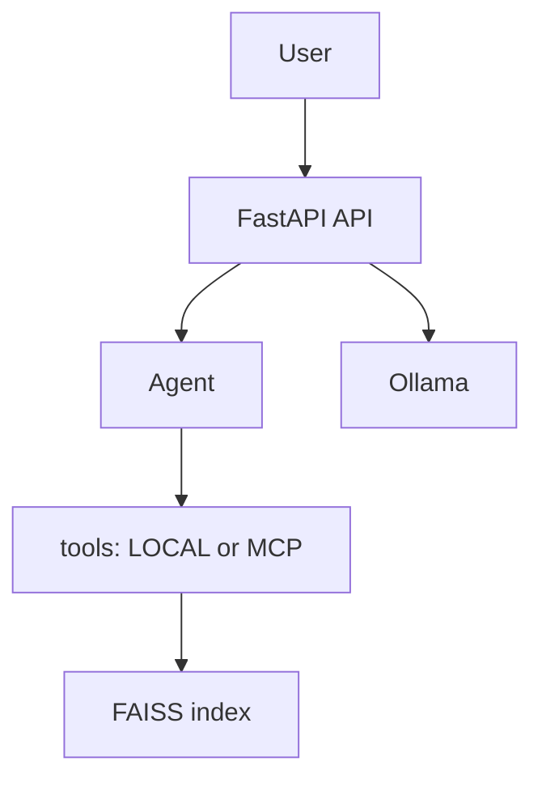

# llm-rag-agent-pet

## Docker quickstart

Linux/macOS:

```bash
docker compose up --build
python scripts/docker_smoke_test.py
```

Windows PowerShell:

```powershell
docker compose up --build
python scripts/docker_smoke_test.py
```

Для демонстрации агента с MCP backend задайте переменную окружения:

```bash
TOOL_BACKEND=mcp docker compose up --build
```

```powershell
$env:TOOL_BACKEND="mcp"
docker compose up --build
```

## Ollama (внешняя зависимость)

Ollama запускается вне контейнеров. Убедитесь, что она доступна на хосте:

```bash
curl http://localhost:11434/api/tags
```

В Docker Compose используется `http://host.docker.internal:11434` для доступа к Ollama.

## Architecture



## What this proves

- RAG + Agent работают поверх локального FAISS индекса.
- Инструменты можно переключать между `local` и `mcp` backend.
- MCP server экспонирует инструменты по HTTP.
- API использует Ollama как внешний LLM.

## Troubleshooting

- PowerShell UTF-8: используйте `chcp 65001` для корректного вывода UTF-8.
- Таймауты LLM: увеличьте `OLLAMA_KEEP_ALIVE` и/или уменьшите `OLLAMA_NUM_PREDICT`.

## MCP

Минимальная совместимая реализация MCP-инструментов (HTTP + JSON), чтобы показать
экспонирование инструментов, клиентское подключение и базовые меры безопасности.

### Запуск MCP server

```bash
python -m scripts.run_mcp_server
```

Переменные окружения:
- `MCP_HOST` (по умолчанию `0.0.0.0`)
- `MCP_PORT` (по умолчанию `9001`)
- `MCP_URL` (для клиента, по умолчанию `http://localhost:9001`)

### Проверка MCP-инструментов

```bash
python -m scripts.demo_mcp_tools
```

Ожидаемое поведение:
- `calc("3.5% * 12000")` возвращает значение около `420`.
- `search_docs("как восстановить доступ к аккаунту?")` показывает `account_security.*`
  среди top источников.
- `Проверка на лимиты (calc)` возвращает `{'error': 'Expression too long (max 200 chars).'}`
- `Проверка на лимиты (search_docs)` возвращает `{'error': 'Query too long (max 2000 chars).'}`

### Агент с MCP backend

```powershell
$env:TOOL_BACKEND="mcp"
python -m scripts.demo_agent_mcp
```

В логах и выводе будет видно, что инструменты вызываются через MCP
(`tool_backend=mcp tool=...`). Этот шаг доказывает:

- MCP server экспонирует инструменты и лимиты.
- MCP client корректно их вызывает.
- Агент работает с переключателем backend’а (local/mcp).